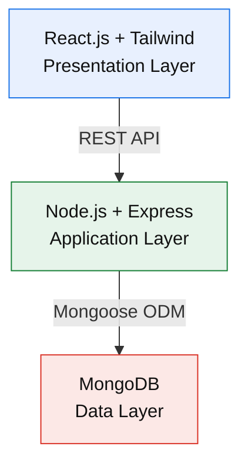

# 🧠 PeerCare IIT — Peer Support Network for Students

A full-stack mental health **peer support web application** built for the **Illinois Institute of Technology** community.  
PeerCare IIT enables students to connect with one another for mutual support, emotional sharing, and personal growth — all while maintaining strong **safety, privacy, and ethical standards**.

> ⚠️ **Disclaimer:** PeerCare IIT provides *peer support, not therapy.*  
> Users are fellow students, not licensed mental-health professionals.

---

## 📋 Table of Contents

- [Overview](#overview)
- [Key Features](#key-features)
- [Technology Stack](#technology-stack)
- [Architecture](#architecture)
- [Installation & Setup](#installation--setup)
- [Environment Variables](#environment-variables)
- [API Endpoints](#api-endpoints)
- [Safety & Ethics](#safety--ethics)
- [Testing](#testing)
- [Future Enhancements](#future-enhancements)
- [Contributors & Acknowledgments](#contributors--acknowledgments)
- [License](#license)

---

## 🧩 Overview

**PeerCare IIT** is a **secure and private peer-to-peer support platform** designed to help Illinois Tech students connect with peers who share similar mental-health challenges and life experiences.

The platform:
- Encourages empathy, not diagnosis.
- Provides immediate, stigma-free support.
- Connects IIT students exclusively through verified email access.
- Integrates safety tools, crisis resources, and ethical guidelines.

**Key Accomplishment:**  
Successfully developed and deployed a full-stack web app featuring authentication, peer connections, messaging, journaling, crisis detection, and IIT-specific verification systems. 
---

## 💡 Key Features

### 🧍 User System
- IIT-only registration with **@iit.edu / @hawk.iit.edu** validation.
- Secure **email verification** before account activation.
- JWT-based session management with token expiration.

### 🤝 Peer Connections
- Browse and connect with other verified IIT students.
- Match based on **shared struggles and interests**.
- Connection requests with accept/reject/block workflow.

### 💬 Messaging
- One-on-one secure text chat.
- Persistent message history with timestamps and read receipts.
- Client-side **crisis keyword detection** (e.g., “suicide”, “self-harm”).
- Built-in report and block functions for safety.

### 📔 Wellness Journal
- Private personal journaling with **mood tracking**.
- Tag entries (e.g., “anxiety”, “coping”).
- Visualize mood trends over time.

### 💬 Daily Motivation
- Rotating quotes on **resilience, mindfulness, and growth**.

### 🚨 Crisis Resources
Quick access to both national and IIT-specific help:
- **988** Suicide & Crisis Lifeline  
- **IIT Counseling Services:** (312) 567-3484  
- **Campus Public Safety:** (312) 567-3000  
- **Crisis Text Line:** Text *HOME* to 741741  

### 🛡️ Community Guidelines
- Respectful communication only — no harassment, graphic, or sexual content.  
- Report mechanism with clear escalation and ban protocols.  
- Explicit “Peer Support, Not Therapy” reminder throughout UI.

---

## ⚙️ Technology Stack

### 🖥 Frontend
| Technology | Version | Purpose |
|-------------|----------|----------|
| React | 19.1.0 | UI Framework |
| React Router | 7.9.3 | Client-side routing |
| Tailwind CSS | 3.4.17 | Styling |
| Axios | 1.12.2 | API communication |
| Lucide React | 0.544.0 | Icons |
| date-fns | 4.1.0 | Date utilities |
| Vite | 7.0.4 | Build tool |

### ⚙️ Backend
| Technology | Version | Purpose |
|-------------|----------|----------|
| Node.js | 18+ | Runtime |
| Express.js | 5.1.0 | API framework |
| MongoDB | 8.18.3 | NoSQL Database |
| Mongoose | 8.18.3 | ODM |
| JWT | 9.0.2 | Authentication |
| bcryptjs | 3.0.2 | Password hashing |
| express-validator | 7.2.1 | Input validation |

---

## 🏗 Architecture (Mermaid)




**Data Collections:**  
- `Users` — authentication & profiles  
- `Connections` — peer relationships  
- `Messages` — conversation history  
- `Journal` — private wellness logs

---

## 🧰 Installation & Setup

### Prerequisites
- Node.js (v16 or higher)  
- MongoDB (local or Atlas)  
- Git

### 1️⃣ Clone the Repository
```bash
git clone https://github.com/yashashreekarri/PeerCare.git
cd PeerCare
```
 ### 2️⃣ Backend Setup
 ```bash
 cd backend
npm install
```
Create a .env file:
```bash
MONGODB_URI=<your-mongodb-uri>
JWT_SECRET=<your-secret>
PORT=5000
FRONTEND_URL=http://localhost:5173
```
Start the backend:
```bash
npm run dev
```
3️⃣ Frontend Setup
```bash
cd ../frontend
npm install
```
Create .env:
```bash
VITE_API_URL=http://localhost:5000/api
```
Run the app:
```bash
npm run dev
```

Access:
Frontend → http://localhost:5173
Backend API → http://localhost:5000/api

🔑 Environment Variables
Variable	Description
MONGODB_URI	MongoDB connection string
JWT_SECRET	Token signing key
PORT	Backend server port
FRONTEND_URL	Client base URL
VITE_API_URL	API URL used in frontend
📡 API Endpoints
Authentication
Method	Endpoint	Description
POST	/auth/register	Register IIT student
POST	/auth/login	Authenticate user
POST	/auth/verify-email	Verify IIT email
GET	/auth/me	Get user profile
Users
Method	Endpoint	Description
GET	/users/browse	Browse available peers
GET	/users/profile/:id	View user profile
PUT	/users/profile	Update profile
Connections
Method	Endpoint	Description
POST	/connections/request	Send connection request
PUT	/connections/:id/accept	Accept request
DELETE	/connections/:id	Remove connection
Messaging
Method	Endpoint	Description
GET	/messages/:userId	Get chat history
POST	/messages	Send message
Journal
Method	Endpoint	Description
GET	/journal	Fetch entries
POST	/journal	Add new entry
PUT	/journal/:id	Update entry
DELETE	/journal/:id	Delete entry

🧠 Safety & Ethics

Do No Harm — technology designed to reduce, not cause, risk.

Privacy First — no continuous message monitoring; user-triggered reporting only.

Transparency — disclaimers clarify that it’s peer support, not therapy.

Crisis Handling — automatic display of crisis resources if high-risk keywords are detected.

Access Control — IIT email verification required.

Reporting & Moderation — user-flagging system with admin escalation.

🧪 Testing
Testing Scope

Unit tests for all APIs and utilities

Integration tests for auth, connection, and messaging flow

Browser/device compatibility testing (Chrome, Edge, Safari, Firefox)

Security testing (JWT validation, input sanitization, penetration checks)

Tools

Postman, React DevTools, Chrome DevTools, npm audit

GitHub Issues for bug tracking

AI-powered sentiment and resource suggestions

🙌 Contributors & Acknowledgments

Author: Yashashree Reddy

Advisor: Dr. Kevin W. Cassel
Institution: Illinois Institute of Technology
Course: [Course Code – Independent Project / Final Project]

Special Thanks 

IIT Counseling Services for guidance and crisis resource details

Open-source community for React, Node.js, and MongoDB ecosystem

📜 License

This project is released for educational and research purposes only.
For any adaptation or wider deployment, please credit PeerCare IIT and include proper disclaimers.

🌱 “Technology with empathy, designed for student wellbeing.”

---

